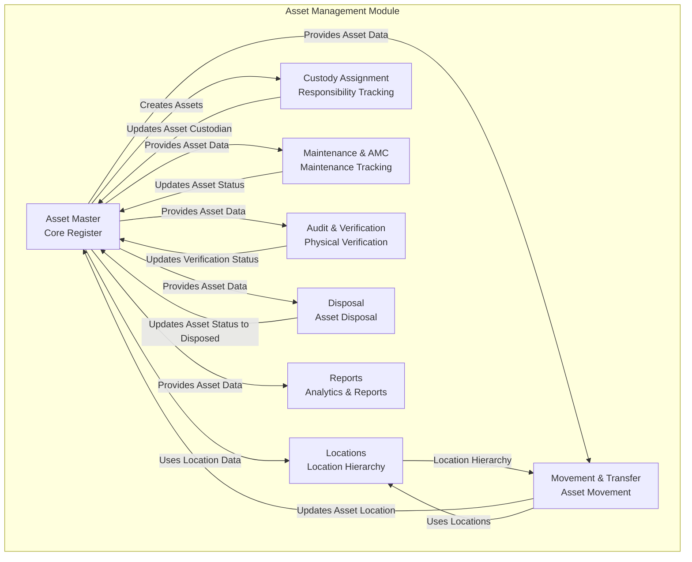
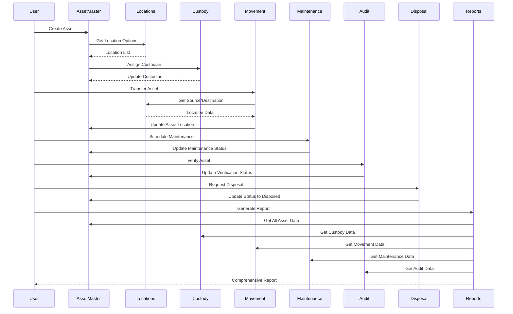
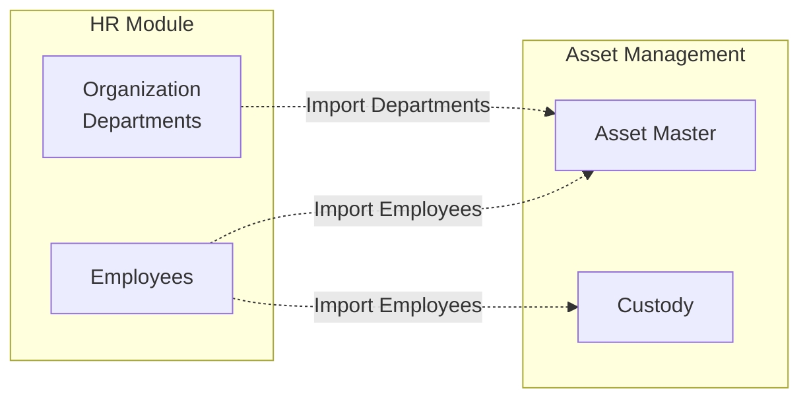
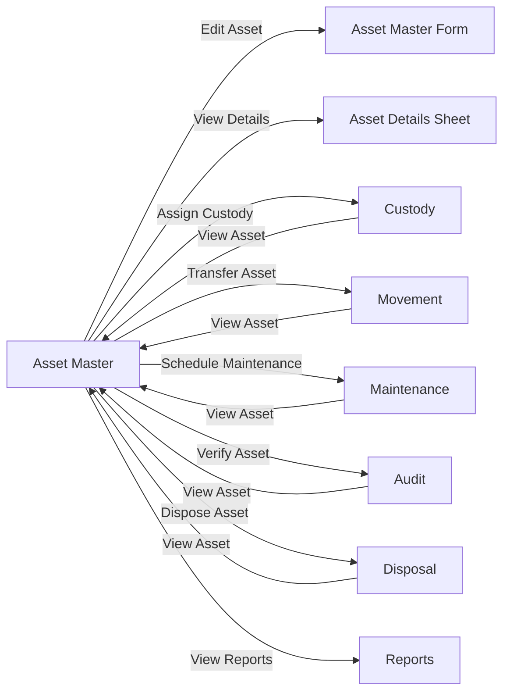
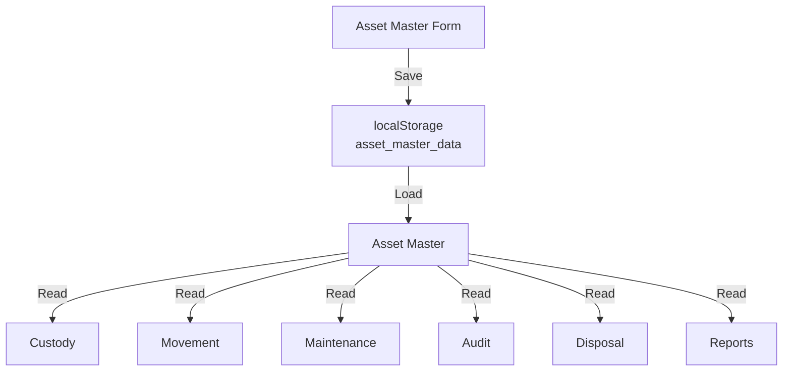
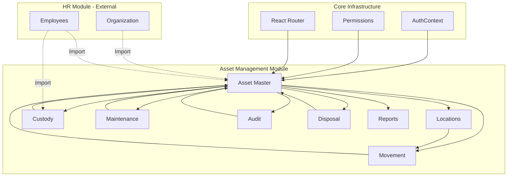

# Asset Management Module - Sub-Module Flows and Linkages

## 1. Asset Management Sub-Module Flow

### Internal Sub-Module Structure



### Sub-Module Descriptions

1. **Asset Master** (`/assets/master`)

   - Central hub for all assets
   - Creates, edits, views assets
   - Stores asset master data in localStorage
   - File: `src/pages/assets/AssetMaster.tsx`

2. **Locations** (`/assets/locations`)

   - Manages location hierarchy (Building > Room > Section)
   - Used by Asset Master for asset location
   - Used by Movement for source/destination
   - File: `src/pages/assets/AssetLocations.tsx`

3. **Custody Assignment** (`/assets/custody`)

   - Assigns custodians to assets
   - Links assets to HR employees/departments
   - Updates asset custodian information
   - File: `src/pages/assets/AssetCustody.tsx`

4. **Movement & Transfer** (`/assets/movement`)

   - Transfers assets between locations
   - Uses locations from Locations module
   - Updates asset location in Asset Master
   - File: `src/pages/assets/AssetMovement.tsx`

5. **Maintenance & AMC** (`/assets/maintenance`)

   - Tracks maintenance schedules
   - Manages AMC contracts
   - Updates asset maintenance status
   - File: `src/pages/assets/Maintenance.tsx`

6. **Audit & Verification** (`/assets/audit`)

   - Physical verification of assets
   - Records audit results
   - Updates asset verification status
   - File: `src/pages/assets/AssetAudit.tsx`

7. **Disposal** (`/assets/disposal`)

   - Manages asset disposal requests
   - Approval workflow
   - Updates asset status to disposed
   - File: `src/pages/assets/AssetDisposal.tsx`

8. **Reports** (`/assets/reports`)

   - Aggregates data from all sub-modules
   - Generates analytics and reports
   - File: `src/pages/assets/AssetReports.tsx`

---

## 2. Data Flow Within Asset Module

### Flow Diagram



---

## 3. Asset Module Links to Other Modules

### Cross-Module Linkages



### Implementation Details

**File**: `src/components/assets/AssetMasterInlineForm.tsx` (lines 138-151)

```typescript
// Import HR module data
import { hrDepartments } from '@/data/hr-dummy-data';
import { getEmployees } from '@/lib/hr-employee-store';

// Use HR departments for asset department selection
const departmentOptions = useMemo(() => {
  return hrDepartments
    .filter(dept => dept.status === 'active')
    .map(dept => ({ value: dept.id, label: dept.name }));
}, []);

// Use HR employees for custodian selection
const custodianOptions = useMemo(() => {
  const employees = getEmployees();
  return employees.map(emp => ({ 
    value: emp.id, 
    label: `${emp.name}${emp.designation ? ` - ${emp.designation}` : ''}` 
  }));
}, []);
```

**File**: `src/components/assets/CustodyAssignmentModal.tsx`

```typescript
// Uses HR departments for custody assignment
import { departments } from '@/data/hr-dummy-data';
```

---

## 4. Navigation Flow Between Sub-Modules

### Navigation Patterns



### Implementation

**File**: `src/pages/assets/AssetMaster.tsx`

```typescript
// Navigate to edit asset
navigate(`/assets/master/${row.id}/edit`);

// Navigate to create new asset
navigate('/assets/master/new');
```

---

## 5. Data Storage and Sharing

### localStorage Keys

- `asset_master_data` - Stores all assets (Asset Master)
- `asset_categories` - Stores asset categories
- Asset locations, custody, movements, maintenance, audits stored in dummy data files

### Data Flow



---

## 6. Complete Asset Module Architecture

### Full Flow Diagram



---

## 7. Files to Document

1. **Asset sub-module flow diagram** - Visual representation of internal flows
2. **Cross-module linkage documentation** - How Asset links to HR
3. **Navigation patterns** - How users move between sub-modules
4. **Data flow documentation** - How data flows between sub-modules
5. **Implementation examples** - Code snippets showing linkages

The documentation will be created as a markdown file with embedded mermaid diagrams showing:

- Internal sub-module flows within Asset Management
- Cross-module data dependencies (Asset → HR)
- Navigation patterns
- Code implementation examples