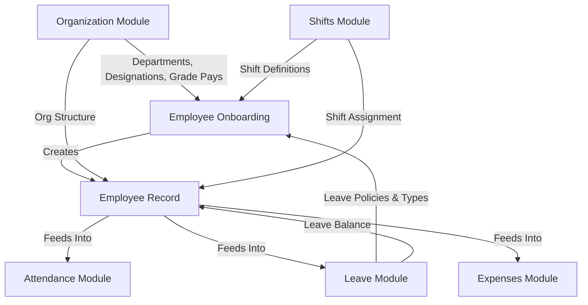
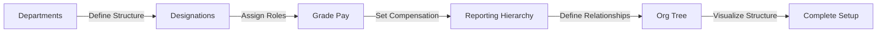
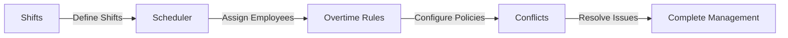
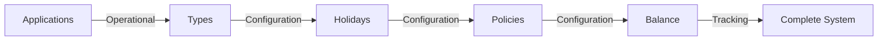
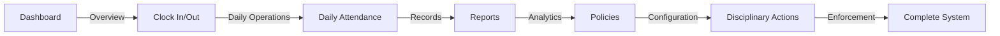
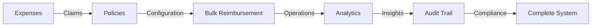
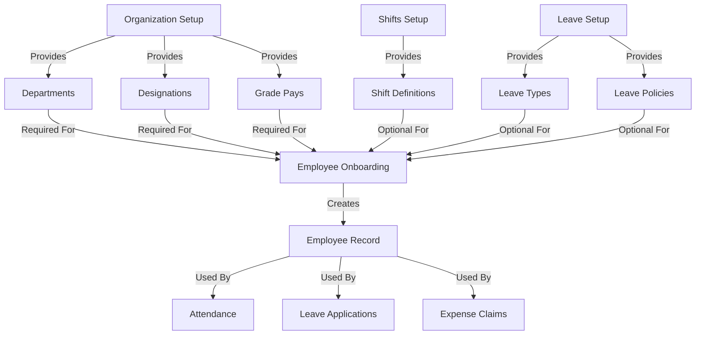
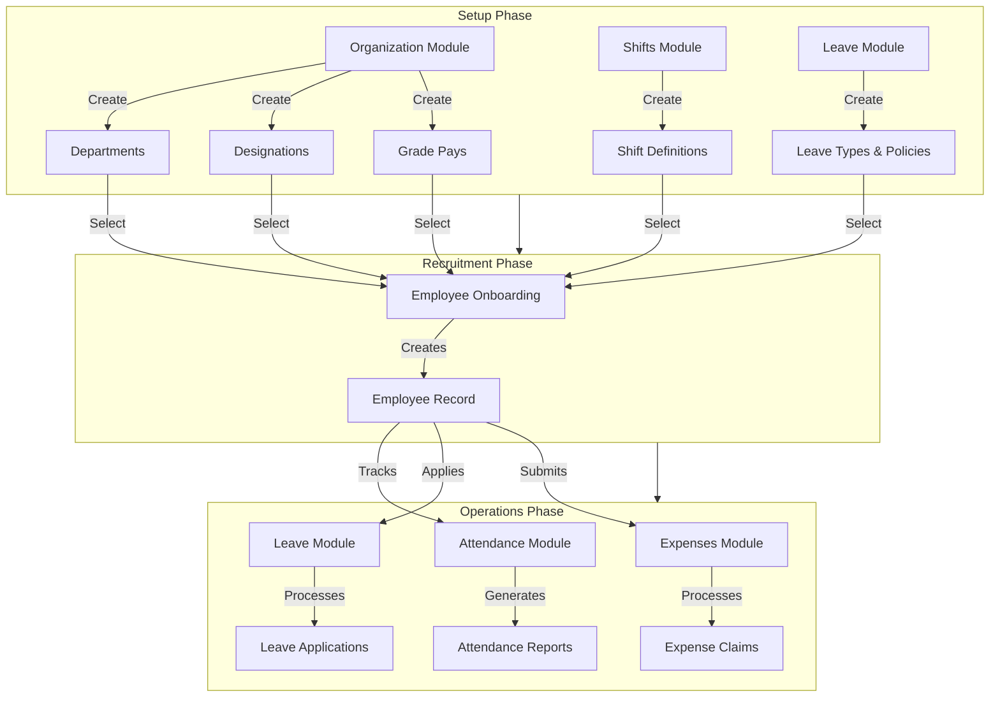
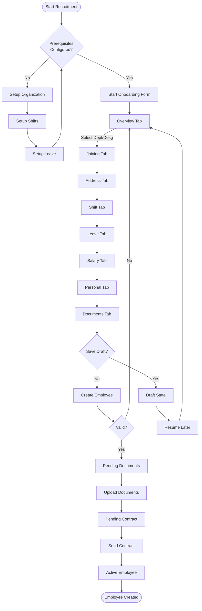

# People/HR Module - Flows and Sub-Modules Interconnection Documentation

## Overview

This documentation explains how the People/HR module works, how its sub-modules are interconnected, and the recruitment setup process (employee onboarding flow). The documentation uses generic terminology applicable to any organization type (not specific to any particular industry).

## Table of Contents

1. [Module Overview](#module-overview)
2. [Sub-Modules Structure](#sub-modules-structure)
3. [Recruitment Setup Flow](#recruitment-setup-flow)
4. [Module Interconnections](#module-interconnections)
5. [Tab Organization and Workflows](#tab-organization-and-workflows)
6. [Detailed Module Flows](#detailed-module-flows)
7. [Key Implementation Features](#key-implementation-features)
8. [Data Dependencies](#data-dependencies)
9. [Common Workflows](#common-workflows)

---

## Module Overview

The People/HR module consists of **6 main sub-modules** that work together to manage the complete employee lifecycle from recruitment to daily operations:

1. **Employees** - Employee directory and profiles
2. **Organization** - Organizational structure setup
3. **Shifts** - Work shift configuration and management
4. **Leave & Holidays** - Leave management system
5. **Attendance** - Daily attendance tracking
6. **Expenses** - Employee expense management

### Key Files

- **Module Definition**: `MODULES_AND_SUBMODULES.md` - Lists all HR sub-modules
- **Routing**: `src/App.tsx` - Defines all HR routes
- **Sidebar Navigation**: `src/components/layout/AppSidebar.tsx` - Module navigation structure
- **Types**: `src/types/hr.ts` - HR-related TypeScript interfaces

---

## Sub-Modules Structure

### 1. Employees (`/hr/employees`)

**Purpose**: Main employee directory and profile management

**Routes**:
- `/hr/employees` - Employee list/directory
- `/hr/employees/:id` - Employee profile view
- `/hr/employees/new` - Employee onboarding (recruitment setup)

**Entry Point**: `src/pages/hr/Employees.tsx`

**Key Features**:
- Employee directory with search and filters
- Bulk import/export functionality
- Employee profile management
- Links to onboarding process

**Related Components**:
- `src/components/hr/EmployeeBulkImport.tsx` - Bulk employee import
- `src/components/hr/EmployeeDocuments.tsx` - Document management
- `src/pages/hr/EmployeeProfile.tsx` - Detailed employee profile
- `src/pages/hr/EmployeeOnboarding.tsx` - Onboarding form

### 2. Organization (`/hr/organization`)

**Purpose**: Foundation for recruitment setup - defines organizational structure

**Route**: `/hr/organization`

**Entry Point**: `src/pages/hr/Organization.tsx`

**Tabs** (5 tabs organizing hierarchical setup):
1. **Departments** - Define organizational departments
2. **Roles & Designations** - Create job roles and designations
3. **Grade Pay** - Configure salary grades and pay scales
4. **Reporting Hierarchy** - Set up reporting relationships
5. **Org Tree** - Visual organizational hierarchy view

**Key Features**:
- Department management with hierarchical structure
- Designation creation linked to departments
- Grade pay configuration for compensation
- Reporting hierarchy setup
- Visual org tree representation

**Related Components**:
- `src/components/hr/DepartmentModal.tsx` - Department creation/edit
- `src/components/hr/DesignationModal.tsx` - Designation management
- `src/components/hr/GradePayModal.tsx` - Grade pay configuration
- `src/components/hr/ReportingHierarchy.tsx` - Hierarchy management
- `src/components/hr/OrgTreeNode.tsx` - Org tree visualization

### 3. Shifts (`/hr/shifts`)

**Purpose**: Shift configuration and management

**Route**: `/hr/shifts`

**Entry Point**: `src/pages/hr/Shifts.tsx`

**Tabs** (4 tabs organizing shift workflow):
1. **Shifts** - Define shift timings and patterns
2. **Scheduler** - Schedule employees to shifts
3. **Overtime Rules** - Configure overtime policies
4. **Conflicts** - Resolve shift scheduling conflicts

**Key Features**:
- Shift definition (timings, breaks, working hours)
- Department-specific shift assignment
- Shift scheduling for employees
- Overtime rule configuration
- Conflict detection and resolution

**Related Components**:
- `src/components/hr/ShiftModal.tsx` - Shift creation/edit
- `src/components/hr/ShiftScheduler.tsx` - Employee shift scheduling
- `src/components/hr/OvertimeRules.tsx` - Overtime configuration
- `src/components/hr/ShiftConflictResolver.tsx` - Conflict resolution

### 4. Leave & Holidays (`/hr/leave`)

**Purpose**: Leave management system

**Route**: `/hr/leave`

**Entry Point**: `src/pages/hr/Leave.tsx`

**Tabs** (5 tabs organizing leave workflow):
1. **Applications** - Leave application management (operational)
2. **Leave Types** - Configure leave types (configuration)
3. **Holidays** - Manage holidays calendar (configuration)
4. **Leave Policies** - Define leave policies (configuration)
5. **Leave Balance** - Track employee leave balances (tracking)

**Key Features**:
- Leave application submission and approval workflow
- Multiple leave types (Casual, Sick, Earned, etc.)
- Holiday calendar management
- Leave policy configuration with rules
- Leave balance tracking
- Coverage impact analysis

**Related Components**:
- `src/components/hr/LeaveTypeModal.tsx` - Leave type configuration
- `src/components/hr/HolidayModal.tsx` - Holiday management
- `src/components/hr/LeaveBalanceTracker.tsx` - Balance tracking
- `src/components/hr/CoverageImpactAnalysis.tsx` - Impact analysis

### 5. Attendance (`/hr/attendance`)

**Purpose**: Daily attendance tracking

**Route**: `/hr/attendance`

**Entry Point**: `src/pages/hr/Attendance.tsx`

**Tabs** (6 tabs organizing attendance workflow):
1. **Dashboard** - Attendance overview and statistics
2. **Clock In/Out** - Daily clock in/out operations
3. **Daily Attendance** - Daily attendance records
4. **Reports** - Attendance reports and analytics
5. **Policies** - Attendance policy configuration
6. **Disciplinary Actions** - Handle attendance violations

**Key Features**:
- Real-time attendance dashboard
- Clock in/out functionality
- Daily attendance marking
- Attendance reports generation
- Attendance policy management
- Disciplinary action tracking

**Related Components**:
- `src/components/hr/AttendanceDashboard.tsx` - Dashboard view
- `src/components/hr/ClockInOut.tsx` - Clock in/out interface
- `src/pages/hr/DailyAttendance.tsx` - Daily records
- `src/pages/hr/AttendanceReports.tsx` - Report generation
- `src/pages/hr/AttendancePolicies.tsx` - Policy management
- `src/components/hr/DisciplinaryActions.tsx` - Violation handling

### 6. Expenses (`/hr/expenses`)

**Purpose**: Employee expense management

**Route**: `/hr/expenses`

**Entry Point**: `src/pages/hr/Expenses.tsx`

**Tabs** (5 tabs organizing expense workflow):
1. **Expenses** - Expense claim submission and management
2. **Policies** - Expense policy configuration
3. **Bulk Reimbursement** - Bulk payment processing
4. **Analytics** - Expense analytics and insights
5. **Audit Trail** - Expense audit and compliance

**Key Features**:
- Expense claim submission with receipts
- Multi-level approval workflow
- Expense policy configuration
- Bulk reimbursement processing
- Expense analytics and reporting
- Complete audit trail

**Related Components**:
- `src/components/hr/ExpensePolicies.tsx` - Policy management
- `src/components/hr/BulkReimbursement.tsx` - Bulk processing
- `src/components/hr/ExpenseAnalytics.tsx` - Analytics dashboard
- `src/components/hr/ExpenseAuditTrail.tsx` - Audit logging
- `src/components/hr/ReceiptUpload.tsx` - Receipt management

---

## Recruitment Setup Flow

### Overview

The recruitment setup process is handled through the **Employee Onboarding** flow, which collects all necessary employee information through a multi-tab form. This process requires certain prerequisites to be set up first.

### Prerequisites (Must be Set Up First)

Before onboarding a new employee, the following must be configured:

1. **Organization Structure** (`/hr/organization`)
   - **Departments** must exist (at least one)
   - **Designations** must be created
   - **Grade Pays** must be configured
   - These are referenced as dropdown options during onboarding

2. **Shifts** (`/hr/shifts`) - Optional but recommended
   - Shift definitions should be created
   - Used for shift assignment during onboarding

3. **Leave Policies** (`/hr/leave`) - Optional but recommended
   - Leave types should be configured
   - Leave policies should be defined
   - Used for leave balance assignment

### Onboarding Process Flow

**Entry Point**: Navigate to `/hr/employees/new` or click "Add Employee" from the Employees page

**Multi-Tab Form** with 8 tabs (sequential workflow):

1. **Overview Tab**
   - Employee code (auto-generated)
   - First name, last name (required)
   - Email, phone (required)
   - Department selection (required - dropdown with add button)
   - Designation selection (required - dropdown with add button)
   - Reporting manager
   - Employment type (Full Time, Part Time, Contract, Volunteer)

2. **Joining Tab**
   - Joining date (required)
   - Probation end date
   - Confirmation date
   - Notice period (days)

3. **Address & Contact Tab**
   - Current address
   - Permanent address
   - City, state, pincode
   - Emergency contact details (name, phone, relation)

4. **Shift & Attendance Tab**
   - Shift selection (dropdown with add button)
   - Work location
   - Biometric ID (optional)

5. **Leave Tab**
   - Leave policy selection
   - Casual leave quota
   - Sick leave quota
   - Earned leave quota

6. **Salary Tab**
   - Grade pay selection (dropdown with add button)
   - Basic salary
   - Allowances (HRA, Conveyance, Medical, Special Allowance)
   - Deductions (PF, ESI)
   - Bank details (Bank name, Account number, IFSC code)

7. **Personal Tab**
   - Date of birth
   - Gender
   - Blood group
   - Marital status
   - Nationality
   - Religion
   - Aadhar number
   - PAN number

8. **Documents Tab**
   - Document upload workflow
   - Workflow status tracking (draft → pending_documents → pending_contract → active)
   - Email template sending (Welcome, Credentials, Contract)

### Workflow States

The onboarding process follows these states:

- `draft` - Initial state, form being filled
- `pending_documents` - Waiting for document uploads
- `pending_contract` - Waiting for contract generation/signing
- `active` - Employee successfully onboarded

### Data Dependencies

| Data Source | Used In Tab | Required/Optional | Purpose |
|------------|-------------|-------------------|---------|
| Department (Organization) | Overview | Required | Employee department assignment |
| Designation (Organization) | Overview | Required | Employee role assignment |
| Grade Pay (Organization) | Salary | Required | Salary structure assignment |
| Shift (Shifts) | Shift & Attendance | Optional | Work shift assignment |
| Leave Policy (Leave) | Leave | Optional | Leave balance assignment |

---

## Module Interconnections

The HR modules are interconnected through data dependencies and workflows:



### Detailed Interconnections

#### 1. Organization → Employee Onboarding
- **Departments** are dropdown options in Overview tab
- **Designations** are dropdown options in Overview tab
- **Grade Pays** are dropdown options in Salary tab
- Cannot complete onboarding without these being configured
- Dropdowns include "+ Add" buttons for quick creation

#### 2. Shifts → Employee Onboarding
- **Shifts** are selectable in Shift & Attendance tab
- Biometric ID can be assigned during onboarding
- Shift assignment links employee to shift schedule

#### 3. Leave Policies → Employee Onboarding
- **Leave Policies** determine initial leave balances
- Leave types (CL, SL, EL) are assigned based on policy
- Leave quotas are set during onboarding

#### 4. Employee Onboarding → Employees
- Completed onboarding creates employee record
- Employee appears in Employees directory
- Employee profile becomes accessible

#### 5. Employees → Other Modules
Employee data feeds into:
- **Attendance Module**: Employee attendance tracking
- **Leave Module**: Leave application processing
- **Expenses Module**: Expense claim submission
- **Shifts Module**: Shift assignment and scheduling

---

## Tab Organization and Workflows

Tabs within each HR sub-module create logical workflows by grouping related functionality. This organization helps users understand the natural progression of tasks and reduces complexity.

### 1. Organization Module Tabs - Hierarchical Setup Flow

**Flow**: Departments → Designations → Grade Pay → Reporting Hierarchy → Org Tree



**Rationale**: 
- Start with organizational structure (departments)
- Then define roles within departments (designations)
- Set compensation levels (grade pay)
- Establish reporting relationships (hierarchy)
- Finally visualize the complete structure (org tree)

**Each tab builds on previous data** - designations require departments, grade pay is linked to designations, etc.

### 2. Shifts Module Tabs - Shift Management Flow

**Flow**: Shifts → Scheduler → Overtime Rules → Conflicts



**Rationale**:
- First define shift timings and patterns
- Then schedule employees to shifts
- Configure overtime rules for extra hours
- Finally resolve any scheduling conflicts

**Operational flow** from setup to management.

### 3. Leave Module Tabs - Leave Management Flow

**Flow**: Applications → Types → Holidays → Policies → Balance



**Rationale**:
- Applications tab for daily operations (applying/approving leave)
- Types, Holidays, Policies tabs for configuration (set up rules)
- Balance tab for tracking (monitor leave balances)

**Separates configuration from operations** - configure rules first, then manage applications, then track balances.

### 4. Attendance Module Tabs - Attendance Management Flow

**Flow**: Dashboard → Clock In/Out → Daily Attendance → Reports → Policies → Disciplinary Actions



**Rationale**:
- Start with overview (dashboard)
- Perform daily operations (clock in/out)
- Review daily records
- Generate reports for analysis
- Configure policies
- Handle violations through disciplinary actions

**Complete attendance lifecycle** from daily operations to policy enforcement.

### 5. Expenses Module Tabs - Expense Management Flow

**Flow**: Expenses → Policies → Bulk Reimbursement → Analytics → Audit Trail



**Rationale**:
- Submit and manage expense claims
- Configure expense policies
- Process bulk reimbursements
- Analyze expense trends
- Maintain audit trail for compliance

**Operational to analytical flow** - from daily operations to strategic insights.

### Benefits of Tab Organization

1. **Logical Grouping**: Related functions are grouped together
2. **Workflow Clarity**: Tabs show natural progression of tasks
3. **Reduced Complexity**: Complex modules broken into manageable sections
4. **Context Preservation**: Stay within module while switching functions
5. **Progressive Disclosure**: Show only relevant functionality at each step

---

## Key Implementation Features

### Dropdown Add Buttons

All `SearchableSelect` components support adding new items directly from dropdowns:

**Implementation**:
- `addNewLabel` prop: Text shown for add button (e.g., "+ Add Department")
- `onAddNew` prop: Callback function when add button is clicked
- Opens modal/form to create new item
- New item is immediately available in dropdown

**Example Usage** (from `src/pages/hr/Employees.tsx`):
```typescript
<SearchableSelect
  options={departmentOptions}
  value={formData.department}
  onChange={(value) => updateForm('department', value)}
  placeholder="Select department"
  addNewLabel="+ Add Department"
  onAddNew={handleAddDepartment}
/>
```

**Benefits**:
- Quick creation without leaving current form
- Context-aware item creation
- Improved user experience
- Reduces navigation overhead

**Where Used**:
- Employee onboarding form (Department, Designation, Shift, Grade Pay)
- Organization module (various dropdowns)
- Other HR forms requiring selection

### Custom Fields in Modals

Modals support custom fields for extensibility, allowing organizations to add domain-specific fields:

**Two Implementations**:

1. **CustomFieldsEditor** (`src/components/structure/CustomFieldsEditor.tsx`)
   - For key-value pairs: `Record<string, string>`
   - Simple text fields
   - Used in: Structure modals, Asset modals

2. **CustomFields** (`src/components/pr/CustomFields.tsx`)
   - For structured custom fields: `CustomField[]`
   - More complex field types
   - Used in: PR modals, Communication modals

**Usage Pattern**:
- Custom fields tab in modal
- Add/remove fields dynamically
- Fields stored with entity data
- Displayed in detail views

**Example** (from `src/components/structure/TempleModal.tsx`):
```typescript
<TabsContent value="custom" className="mt-4">
  <CustomFieldsEditor
    customFields={formData.customFields}
    onChange={(fields) => setFormData({ ...formData, customFields: fields })}
  />
</TabsContent>
```

**Benefits**:
- Extensibility without code changes
- Organization-specific fields
- Flexible data model
- Future-proof design

### Generic Design

The system uses generic terminology applicable to any organization type:

**Generic Terms Used**:
- Employees (not "staff" or "workers")
- Departments (not "divisions" or "units")
- Designations (not "titles" or "positions")
- Shifts (not "schedules" or "rotations")
- Leave (not "time off" or "vacation")

**No Hardcoded Domain Logic**:
- No industry-specific validations
- No domain-specific business rules
- Configurable through policies and settings
- Applicable to: Corporate, Non-profit, Religious institutions, Educational, Healthcare, etc.

---

## Data Dependencies

### Dependency Graph



### Detailed Dependencies

#### Organization → Onboarding Dependencies

| Organization Component | Onboarding Tab | Dependency Type | Notes |
|----------------------|----------------|-----------------|-------|
| Departments | Overview | Required | Must exist before onboarding |
| Designations | Overview | Required | Must exist before onboarding |
| Grade Pays | Salary | Required | Must exist before onboarding |
| Reporting Hierarchy | Overview | Optional | For reporting manager selection |

#### Shifts → Onboarding Dependencies

| Shifts Component | Onboarding Tab | Dependency Type | Notes |
|-----------------|----------------|-----------------|-------|
| Shift Definitions | Shift & Attendance | Optional | Recommended for proper scheduling |
| Shift Schedules | Shift & Attendance | Not Used | Created after onboarding |

#### Leave → Onboarding Dependencies

| Leave Component | Onboarding Tab | Dependency Type | Notes |
|----------------|----------------|-----------------|-------|
| Leave Types | Leave | Optional | Used for leave balance calculation |
| Leave Policies | Leave | Optional | Determines leave quotas |
| Holidays | Leave | Not Used | Used in leave application processing |

#### Onboarding → Other Modules Dependencies

| Onboarding Data | Used By Module | Purpose |
|----------------|----------------|---------|
| Employee Record | Attendance | Track attendance |
| Employee Record | Leave | Process leave applications |
| Employee Record | Expenses | Submit expense claims |
| Shift Assignment | Shifts | Schedule management |
| Department | Organization | Employee count updates |
| Designation | Organization | Role-based filtering |

### Setup Order Recommendation

For new organization setup, follow this order:

1. **Organization Module** (Foundation)
   - Create Departments
   - Create Designations
   - Configure Grade Pays
   - Set up Reporting Hierarchy

2. **Shifts Module** (Optional but Recommended)
   - Define Shifts
   - Configure Overtime Rules

3. **Leave Module** (Optional but Recommended)
   - Configure Leave Types
   - Set up Holidays
   - Define Leave Policies

4. **Employee Onboarding** (Recruitment)
   - Onboard new employees using configured data

5. **Operational Modules** (Daily Operations)
   - Attendance tracking
   - Leave management
   - Expense processing

---

## Common Workflows

### Workflow 1: Adding a New Employee (Recruitment Setup)

**Steps**:

1. **Prerequisites Check**
   - Ensure at least one Department exists (`/hr/organization` → Departments tab)
   - Ensure at least one Designation exists (`/hr/organization` → Designations tab)
   - Ensure at least one Grade Pay exists (`/hr/organization` → Grade Pay tab)

2. **Start Onboarding**
   - Navigate to `/hr/employees` or click "Add Employee"
   - Click "Add Employee" button
   - Redirects to `/hr/employees/new`

3. **Fill Onboarding Form** (8 tabs)
   - **Overview**: Enter basic info, select department/designation (can add new via dropdown)
   - **Joining**: Set joining date and probation period
   - **Address**: Enter contact information
   - **Shift**: Assign shift (can add new via dropdown)
   - **Leave**: Assign leave policy and quotas
   - **Salary**: Set salary details, select grade pay (can add new via dropdown)
   - **Personal**: Enter personal information
   - **Documents**: Upload required documents

4. **Complete Onboarding**
   - Save draft or create employee
   - Employee appears in directory
   - Employee record available for other modules

**Key Features Used**:
- Dropdown add buttons for quick creation
- Multi-tab form for organized data collection
- Workflow state tracking

### Workflow 2: Setting Up Organization Structure

**Steps**:

1. **Navigate to Organization** (`/hr/organization`)

2. **Create Departments** (Departments tab)
   - Click "Add Department"
   - Enter department name, code
   - Set department head (optional)
   - Define parent department (for hierarchy)
   - Save

3. **Create Designations** (Designations tab)
   - Click "Add Designation"
   - Enter designation name
   - Link to department
   - Assign grade pay
   - Set level
   - Save

4. **Configure Grade Pays** (Grade Pay tab)
   - Click "Add Grade Pay"
   - Enter grade name and code
   - Set salary range (min/max)
   - Configure allowances
   - Set level
   - Save

5. **Set Reporting Hierarchy** (Reporting Hierarchy tab)
   - Assign reporting managers
   - Define organizational relationships
   - Visualize structure

6. **View Org Tree** (Org Tree tab)
   - Visual representation of complete structure
   - Verify hierarchy is correct

**Tab Flow**: Follows hierarchical setup pattern

### Workflow 3: Configuring Shifts and Leave Policies

**Shifts Configuration** (`/hr/shifts`):

1. **Define Shifts** (Shifts tab)
   - Create shift definitions with timings
   - Set break durations
   - Assign to departments

2. **Schedule Employees** (Scheduler tab)
   - Assign employees to shifts
   - Create shift schedules

3. **Configure Overtime** (Overtime Rules tab)
   - Set overtime thresholds
   - Define overtime rates
   - Apply to departments/designations

4. **Resolve Conflicts** (Conflicts tab)
   - Identify scheduling conflicts
   - Resolve overlaps

**Leave Configuration** (`/hr/leave`):

1. **Configure Leave Types** (Types tab)
   - Create leave types (CL, SL, EL, etc.)
   - Set annual quotas
   - Configure carry-forward rules

2. **Set Up Holidays** (Holidays tab)
   - Add holidays to calendar
   - Categorize (national, religious, optional)
   - Publish calendar

3. **Define Policies** (Policies tab)
   - Create leave policies
   - Set applicable rules
   - Configure approval workflows

4. **Track Balances** (Balance tab)
   - Monitor employee leave balances
   - View usage patterns

**Tab Flow**: Configuration → Operations → Tracking

### Workflow 4: Using Custom Fields in Modals

**Steps**:

1. **Open Modal** (any entity creation/edit modal)

2. **Navigate to Custom Fields Tab**
   - Click "Custom" tab in modal

3. **Add Custom Fields**
   - Click "Add Custom Field" button
   - Enter field name (key)
   - Enter field value
   - Add multiple fields as needed

4. **Save Entity**
   - Custom fields saved with entity
   - Available in detail views

**Example Use Cases**:
- Add organization-specific employee attributes
- Store additional department information
- Extend leave types with custom metadata
- Add custom expense categories

**Benefits**:
- No code changes required
- Organization-specific extensions
- Flexible data model

---

## Visual Flow Diagrams

### Complete HR Module Flow



### Recruitment Setup Detailed Flow



### Tab Organization Flow Example (Organization Module)

```mermaid
graph LR
    A[Departments Tab] -->|Create Departments| B[Designations Tab]
    B -->|Create Roles| C[Grade Pay Tab]
    C -->|Set Compensation| D[Reporting Hierarchy Tab]
    D -->|Define Relationships| E[Org Tree Tab]
    E -->|Visualize| F[Complete Setup]
    
    style A fill:#e1f5ff
    style B fill:#e1f5ff
    style C fill:#e1f5ff
    style D fill:#e1f5ff
    style E fill:#e1f5ff
    style F fill:#c8e6c9
```



---

## Summary

The People/HR module is designed with a clear structure:

- **6 main sub-modules** covering the complete employee lifecycle
- **Tab-based organization** creating logical workflows within each module
- **Interconnected modules** sharing data and dependencies
- **Generic design** applicable to any organization type
- **Extensible features** like custom fields and dropdown add buttons

The recruitment setup process (employee onboarding) serves as the entry point, requiring organization structure to be configured first, then collecting comprehensive employee information through a multi-tab form.

All modules work together to provide a complete HR management solution, from initial setup through daily operations, with clear workflows and intuitive organization.
